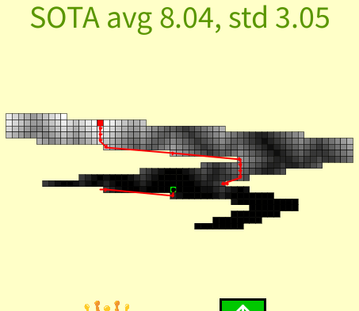

# Typos

Open the sketch in Processing and run it.

Required: install the VideoExport library in your Processing libraries folder (e.g. `Documents/Processing/libraries`) by following the instructions here: 
https://github.com/hamoid/video_export_processing/tree/kotlinGradle

Example evolution output (SOTA snapshot):

